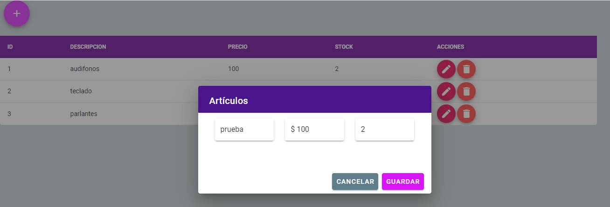
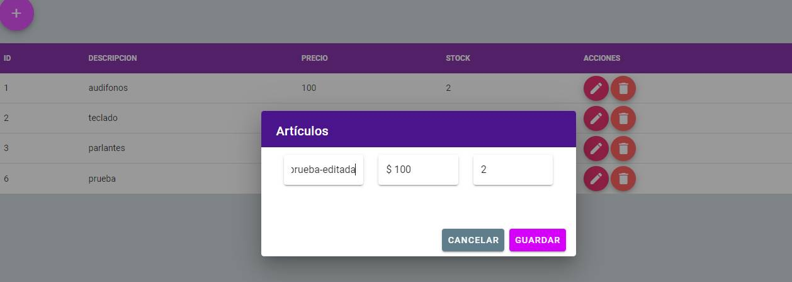
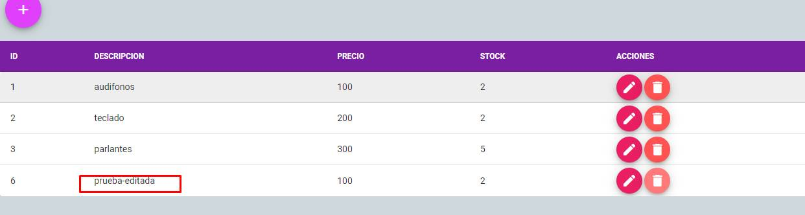
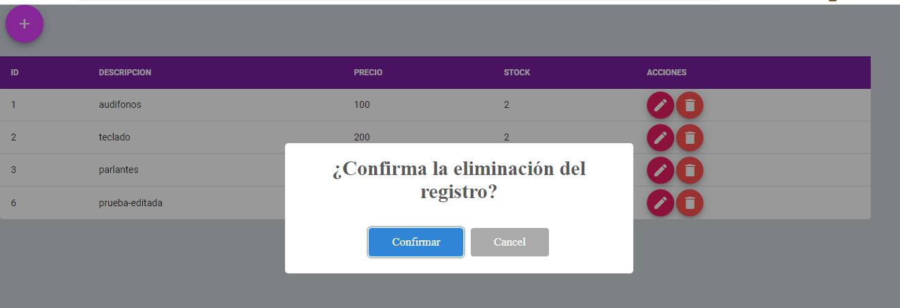
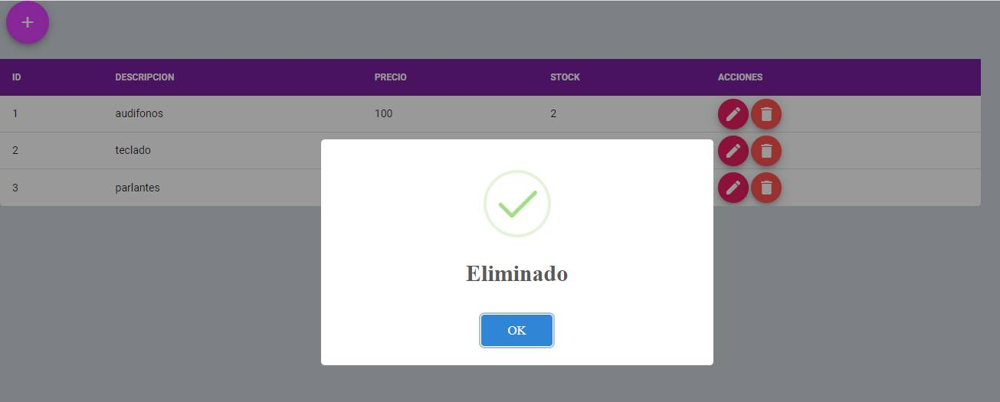

# CRUD FRONTEND API REST WITH VUE 2 & VUETIFY

CRUD API REST - Frontend with Vue 2.

Link Code Backend with LARAVEL 8 --> https://github.com/ronytacodev/api-rest-laravel-8

# Stack

* Cdn Vue 2
* Cdn Vuetify
* Cdn Material Design Icons
* Cdn Sweet Alert
* Google Fonts Roboto
* Cdn Axios

## Screenshot

